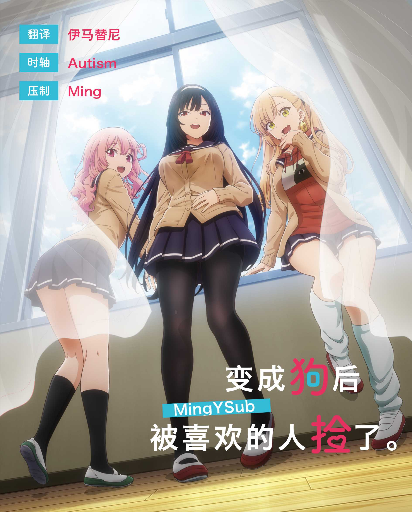

# 变成狗后被喜欢的人捡了。 / Inu ni Nattara Suki na Hito ni Hirowareta.
| 剧集 | 中文标题 | 对应片源 | 字幕 |
| ---- | -------- | -------- | ---- |
| 01 | 伸手。 | Web | [简日](https://raw.githubusercontent.com/MingYSub/SubArchive/main/Archive/Inu%20ni%20Nattara%20Suki%20na%20Hito%20ni%20Hirowareta/%5BMingY%5D%20Inu%20ni%20Nattara%20Suki%20na%20Hito%20ni%20Hirowareta.%20%5B01%5D.CHS_JPN.ass)　[繁日](https://raw.githubusercontent.com/MingYSub/SubArchive/main/Archive/Inu%20ni%20Nattara%20Suki%20na%20Hito%20ni%20Hirowareta/%5BMingY%5D%20Inu%20ni%20Nattara%20Suki%20na%20Hito%20ni%20Hirowareta.%20%5B01%5D.CHT_JPN.ass)　[简体](https://raw.githubusercontent.com/MingYSub/SubArchive/main/Archive/Inu%20ni%20Nattara%20Suki%20na%20Hito%20ni%20Hirowareta/%5BMingY%5D%20Inu%20ni%20Nattara%20Suki%20na%20Hito%20ni%20Hirowareta.%20%5B01%5D.CHS.ass)　[繁體](https://raw.githubusercontent.com/MingYSub/SubArchive/main/Archive/Inu%20ni%20Nattara%20Suki%20na%20Hito%20ni%20Hirowareta/%5BMingY%5D%20Inu%20ni%20Nattara%20Suki%20na%20Hito%20ni%20Hirowareta.%20%5B01%5D.CHT.ass)　[日本語](https://raw.githubusercontent.com/MingYSub/SubArchive/main/Archive/Inu%20ni%20Nattara%20Suki%20na%20Hito%20ni%20Hirowareta/%5BMingY%5D%20Inu%20ni%20Nattara%20Suki%20na%20Hito%20ni%20Hirowareta.%20%5B01%5D.JPN.ass) |
| 02 | 散步。 | Web | [简日](https://raw.githubusercontent.com/MingYSub/SubArchive/main/Archive/Inu%20ni%20Nattara%20Suki%20na%20Hito%20ni%20Hirowareta/%5BMingY%5D%20Inu%20ni%20Nattara%20Suki%20na%20Hito%20ni%20Hirowareta.%20%5B02%5D.CHS_JPN.ass)　繁日　简体　繁體　日本語  |
| 03 | 胆小猫。 | Web | [简日](https://raw.githubusercontent.com/MingYSub/SubArchive/main/Archive/Inu%20ni%20Nattara%20Suki%20na%20Hito%20ni%20Hirowareta/%5BMingY%5D%20Inu%20ni%20Nattara%20Suki%20na%20Hito%20ni%20Hirowareta.%20%5B03%5D.CHS_JPN.ass)　繁日　简体　繁體　日本語 |
| 04 | 狗的想法。 | Web | [简日](https://raw.githubusercontent.com/MingYSub/SubArchive/main/Archive/Inu%20ni%20Nattara%20Suki%20na%20Hito%20ni%20Hirowareta/%5BMingY%5D%20Inu%20ni%20Nattara%20Suki%20na%20Hito%20ni%20Hirowareta.%20%5B04%5D.CHS_JPN.ass)　繁日　简体　繁體　日本語 |
| 05 | 逃跑。 | Web | [简日](https://raw.githubusercontent.com/MingYSub/SubArchive/main/Archive/Inu%20ni%20Nattara%20Suki%20na%20Hito%20ni%20Hirowareta/%5BMingY%5D%20Inu%20ni%20Nattara%20Suki%20na%20Hito%20ni%20Hirowareta.%20%5B05%5D.CHS_JPN.ass)　繁日　简体　繁體　日本語 |
| 06 | 寂寞的兔。 | Web | [简日](https://raw.githubusercontent.com/MingYSub/SubArchive/main/Archive/Inu%20ni%20Nattara%20Suki%20na%20Hito%20ni%20Hirowareta/%5BMingY%5D%20Inu%20ni%20Nattara%20Suki%20na%20Hito%20ni%20Hirowareta.%20%5B06%5D.CHS_JPN.ass)　繁日　简体　繁體　日本語 |
| 07 | 狗屋对决。 | Web | [简日](https://raw.githubusercontent.com/MingYSub/SubArchive/main/Archive/Inu%20ni%20Nattara%20Suki%20na%20Hito%20ni%20Hirowareta/%5BMingY%5D%20Inu%20ni%20Nattara%20Suki%20na%20Hito%20ni%20Hirowareta.%20%5B07%5D.CHS_JPN.ass)　繁日　简体　繁體　日本語 |
| 08 | 潜入学校。 | Web | [简日](https://raw.githubusercontent.com/MingYSub/SubArchive/main/Archive/Inu%20ni%20Nattara%20Suki%20na%20Hito%20ni%20Hirowareta/%5BMingY%5D%20Inu%20ni%20Nattara%20Suki%20na%20Hito%20ni%20Hirowareta.%20%5B08%5D.CHS_JPN.ass)　繁日　简体　繁體　日本語 |

# Staff
**翻译/校对：** 伊马替尼　Ming

**时轴：** Autism

**压制/海报：** Ming

注：繁化由 [繁化姬](https://zhconvert.org) 完成。

# 所需字体
字体下载（将在完成全部字幕后提供网盘链接）

```
A-OTF UD新ゴ Pr6N M <A-OTF UD Shin Go Pr6N M>
Candara Bold
EPSON 太丸ゴシック体Ｂ
FOT-ベビポップ Std EB <FOT-BabyPop Std EB>
方正兰亭圆_GBK_中粗 <FZLanTingYuan-DB1-GBK>
汉仪跳跳体简 <HYTiaoTiaoTiJ>
華康平劇體W7 <DFPingJuW7-B5>
華康平劇體W7(P) <DFPPingJuW7-B5>
森泽UD新黑 Gb4 M <MO UDShinGo SC Gb4 M>
```