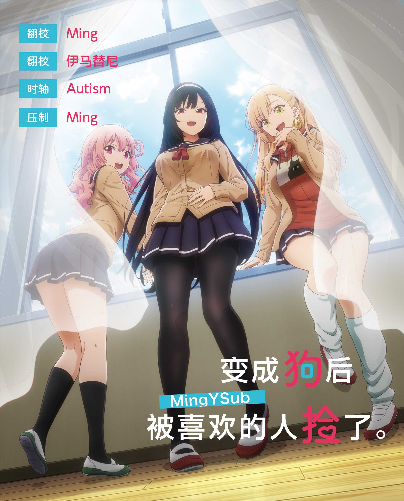

# 变成狗后被喜欢的人捡了。 / Inu ni Nattara Suki na Hito ni Hirowareta.
| 剧集 | 中文标题 | 对应片源 | 字幕 |
| ---- | -------- | -------- | ---- |
| 01 | 伸手 | Web | [简体](https://raw.githubusercontent.com/MingYSub/SubArchive/main/Archive/Inu%20ni%20Nattara%20Suki%20na%20Hito%20ni%20Hirowareta/%5BMingY%5D%20Inu%20ni%20Nattara%20Suki%20na%20Hito%20ni%20Hirowareta.%20%5B01%5D.CHS.ass)　[繁體](https://raw.githubusercontent.com/MingYSub/SubArchive/main/Archive/Inu%20ni%20Nattara%20Suki%20na%20Hito%20ni%20Hirowareta/%5BMingY%5D%20Inu%20ni%20Nattara%20Suki%20na%20Hito%20ni%20Hirowareta.%20%5B01%5D.CHT.ass) |

# Staff
**翻译：** 伊马替尼

**时轴：** Autism

**压制/海报：** Ming

注：繁化由 [繁化姬](https://zhconvert.org) 完成。

# 所需字体
字体下载（将在完成全部字幕后提供网盘链接）

```
Candara Bold
EPSON 太丸ゴシック体Ｂ
FOT-ベビポップ Std EB <FOT-BabyPop Std EB>
方正兰亭圆_GBK_中粗 <FZLanTingYuan-DB1-GBK>
華康平劇體W7 <DFPingJuW7-B5>
華康平劇體W7(P) <DFPPingJuW7-B5>
森泽UD新黑 Gb4 DB <MO UDShinGo SC Gb4 DB>
```