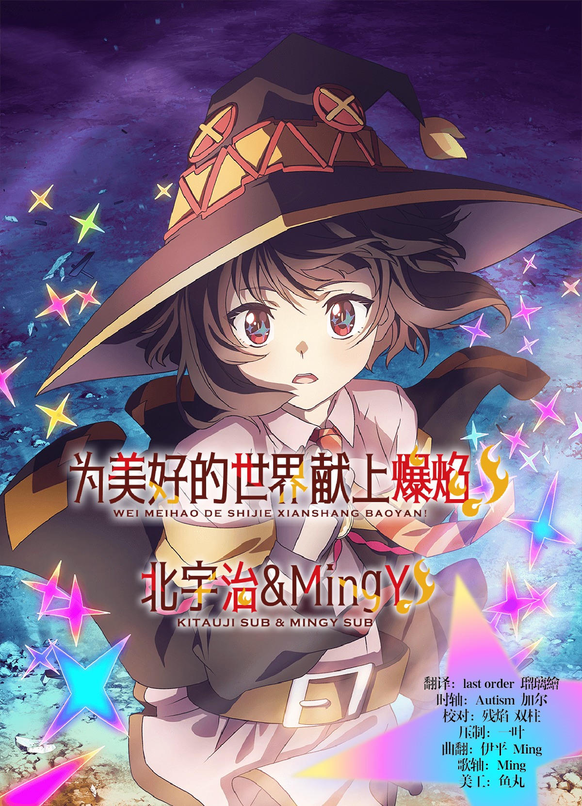

# 为美好的世界献上爆焰！ / Kono Subarashii Sekai ni Bakuen wo!
| 剧集 | 对应片源 | 字幕 |
| ---- | -------- | ---- |
| 01 | BD | [简日](https://raw.githubusercontent.com/MingYSub/SubsArchive/main/Archive/Kono%20Subarashii%20Sekai%20ni%20Bakuen%20wo!/%5BKitaujiSub%26MingY%5D%20Kono%20Subarashii%20Sekai%20ni%20Bakuen%20wo!%20%5B01%5D.CHS_JPN.ass)　[繁日](https://raw.githubusercontent.com/MingYSub/SubsArchive/main/Archive/Kono%20Subarashii%20Sekai%20ni%20Bakuen%20wo!/%5BKitaujiSub%26MingY%5D%20Kono%20Subarashii%20Sekai%20ni%20Bakuen%20wo!%20%5B01%5D.CHT_JPN.ass) |
| 02 | BD | [简日](https://raw.githubusercontent.com/MingYSub/SubsArchive/main/Archive/Kono%20Subarashii%20Sekai%20ni%20Bakuen%20wo!/%5BKitaujiSub%26MingY%5D%20Kono%20Subarashii%20Sekai%20ni%20Bakuen%20wo!%20%5B02%5D.CHS_JPN.ass)　[繁日](https://raw.githubusercontent.com/MingYSub/SubsArchive/main/Archive/Kono%20Subarashii%20Sekai%20ni%20Bakuen%20wo!/%5BKitaujiSub%26MingY%5D%20Kono%20Subarashii%20Sekai%20ni%20Bakuen%20wo!%20%5B02%5D.CHT_JPN.ass) |
| 03 | BD | [简日](https://raw.githubusercontent.com/MingYSub/SubsArchive/main/Archive/Kono%20Subarashii%20Sekai%20ni%20Bakuen%20wo!/%5BKitaujiSub%26MingY%5D%20Kono%20Subarashii%20Sekai%20ni%20Bakuen%20wo!%20%5B03%5D.CHS_JPN.ass)　[繁日](https://raw.githubusercontent.com/MingYSub/SubsArchive/main/Archive/Kono%20Subarashii%20Sekai%20ni%20Bakuen%20wo!/%5BKitaujiSub%26MingY%5D%20Kono%20Subarashii%20Sekai%20ni%20Bakuen%20wo!%20%5B03%5D.CHT_JPN.ass) |
| 04 | BD | [简日](https://raw.githubusercontent.com/MingYSub/SubsArchive/main/Archive/Kono%20Subarashii%20Sekai%20ni%20Bakuen%20wo!/%5BKitaujiSub%26MingY%5D%20Kono%20Subarashii%20Sekai%20ni%20Bakuen%20wo!%20%5B04%5D.CHS_JPN.ass)　[繁日](https://raw.githubusercontent.com/MingYSub/SubsArchive/main/Archive/Kono%20Subarashii%20Sekai%20ni%20Bakuen%20wo!/%5BKitaujiSub%26MingY%5D%20Kono%20Subarashii%20Sekai%20ni%20Bakuen%20wo!%20%5B04%5D.CHT_JPN.ass) |
| 05 | BD | [简日](https://raw.githubusercontent.com/MingYSub/SubsArchive/main/Archive/Kono%20Subarashii%20Sekai%20ni%20Bakuen%20wo!/%5BKitaujiSub%26MingY%5D%20Kono%20Subarashii%20Sekai%20ni%20Bakuen%20wo!%20%5B05%5D.CHS_JPN.ass)　[繁日](https://raw.githubusercontent.com/MingYSub/SubsArchive/main/Archive/Kono%20Subarashii%20Sekai%20ni%20Bakuen%20wo!/%5BKitaujiSub%26MingY%5D%20Kono%20Subarashii%20Sekai%20ni%20Bakuen%20wo!%20%5B05%5D.CHT_JPN.ass) |
| 06 | BD | [简日](https://raw.githubusercontent.com/MingYSub/SubsArchive/main/Archive/Kono%20Subarashii%20Sekai%20ni%20Bakuen%20wo!/%5BKitaujiSub%26MingY%5D%20Kono%20Subarashii%20Sekai%20ni%20Bakuen%20wo!%20%5B06%5D.CHS_JPN.ass)　[繁日](https://raw.githubusercontent.com/MingYSub/SubsArchive/main/Archive/Kono%20Subarashii%20Sekai%20ni%20Bakuen%20wo!/%5BKitaujiSub%26MingY%5D%20Kono%20Subarashii%20Sekai%20ni%20Bakuen%20wo!%20%5B06%5D.CHT_JPN.ass) |
| 07 | BD | [简日](https://raw.githubusercontent.com/MingYSub/SubsArchive/main/Archive/Kono%20Subarashii%20Sekai%20ni%20Bakuen%20wo!/%5BKitaujiSub%26MingY%5D%20Kono%20Subarashii%20Sekai%20ni%20Bakuen%20wo!%20%5B07%5D.CHS_JPN.ass)　[繁日](https://raw.githubusercontent.com/MingYSub/SubsArchive/main/Archive/Kono%20Subarashii%20Sekai%20ni%20Bakuen%20wo!/%5BKitaujiSub%26MingY%5D%20Kono%20Subarashii%20Sekai%20ni%20Bakuen%20wo!%20%5B07%5D.CHT_JPN.ass) |
| 08 | BD | [简日](https://raw.githubusercontent.com/MingYSub/SubsArchive/main/Archive/Kono%20Subarashii%20Sekai%20ni%20Bakuen%20wo!/%5BKitaujiSub%26MingY%5D%20Kono%20Subarashii%20Sekai%20ni%20Bakuen%20wo!%20%5B08%5D.CHS_JPN.ass)　[繁日](https://raw.githubusercontent.com/MingYSub/SubsArchive/main/Archive/Kono%20Subarashii%20Sekai%20ni%20Bakuen%20wo!/%5BKitaujiSub%26MingY%5D%20Kono%20Subarashii%20Sekai%20ni%20Bakuen%20wo!%20%5B08%5D.CHT_JPN.ass) |
| 09 | BD | [简日](https://raw.githubusercontent.com/MingYSub/SubsArchive/main/Archive/Kono%20Subarashii%20Sekai%20ni%20Bakuen%20wo!/%5BKitaujiSub%26MingY%5D%20Kono%20Subarashii%20Sekai%20ni%20Bakuen%20wo!%20%5B09%5D.CHS_JPN.ass)　[繁日](https://raw.githubusercontent.com/MingYSub/SubsArchive/main/Archive/Kono%20Subarashii%20Sekai%20ni%20Bakuen%20wo!/%5BKitaujiSub%26MingY%5D%20Kono%20Subarashii%20Sekai%20ni%20Bakuen%20wo!%20%5B09%5D.CHT_JPN.ass) |
| 10 | BD | [简日](https://raw.githubusercontent.com/MingYSub/SubsArchive/main/Archive/Kono%20Subarashii%20Sekai%20ni%20Bakuen%20wo!/%5BKitaujiSub%26MingY%5D%20Kono%20Subarashii%20Sekai%20ni%20Bakuen%20wo!%20%5B10%5D.CHS_JPN.ass)　[繁日](https://raw.githubusercontent.com/MingYSub/SubsArchive/main/Archive/Kono%20Subarashii%20Sekai%20ni%20Bakuen%20wo!/%5BKitaujiSub%26MingY%5D%20Kono%20Subarashii%20Sekai%20ni%20Bakuen%20wo!%20%5B10%5D.CHT_JPN.ass) |
| 11 | BD | [简日](https://raw.githubusercontent.com/MingYSub/SubsArchive/main/Archive/Kono%20Subarashii%20Sekai%20ni%20Bakuen%20wo!/%5BKitaujiSub%26MingY%5D%20Kono%20Subarashii%20Sekai%20ni%20Bakuen%20wo!%20%5B11%5D.CHS_JPN.ass)　[繁日](https://raw.githubusercontent.com/MingYSub/SubsArchive/main/Archive/Kono%20Subarashii%20Sekai%20ni%20Bakuen%20wo!/%5BKitaujiSub%26MingY%5D%20Kono%20Subarashii%20Sekai%20ni%20Bakuen%20wo!%20%5B11%5D.CHT_JPN.ass) |
| 12 | BD | [简日](https://raw.githubusercontent.com/MingYSub/SubsArchive/main/Archive/Kono%20Subarashii%20Sekai%20ni%20Bakuen%20wo!/%5BKitaujiSub%26MingY%5D%20Kono%20Subarashii%20Sekai%20ni%20Bakuen%20wo!%20%5B12%5D.CHS_JPN.ass)　[繁日](https://raw.githubusercontent.com/MingYSub/SubsArchive/main/Archive/Kono%20Subarashii%20Sekai%20ni%20Bakuen%20wo!/%5BKitaujiSub%26MingY%5D%20Kono%20Subarashii%20Sekai%20ni%20Bakuen%20wo!%20%5B12%5D.CHT_JPN.ass) |

# Staff
本字幕与 **北宇治字幕组** 联合制作

**翻译：** last order　琉璃繪　pluviophile　平原

**时轴：** Autism　加尔

**校对：** 残焰　小企业　双柱

**压制：** 一叶

**歌翻：** 伊平　Ming

**歌轴：** Ming

**海报：** 鱼丸

注：繁化由 [繁化姬](https://zhconvert.org) 完成。

# 所需字体
[字体下载（百度网盘）](https://pan.baidu.com/s/19K0Xlwnz-yeQ1DSMRRo0ig?pwd=1234) [字体下载（蓝奏云）](https://wwi.lanzoup.com/iNFjs1jkepyj) [字体下载（123云盘）](https://www.123pan.com/s/apt4jv-XEAH3.html)

```
A-OTF UD新ゴ Pr6N M <A-OTF UD Shin Go Pr6N M>
A-OTF カモライム Std M <A-OTF KamoLime Std M>
FOT-スーラ ProN DB <FOT-Seurat ProN DB>
方正兰亭圆_GBK_大 <FZLanTingYuan-EB-GBK>
方正兰亭圆_GBK_中 <FZLanTingYuan-DB-GBK>
方正屏显雅宋_GBK <FZPingXianYaSong-R-GBK>
黒薔薇シンデレラ <kurobara-cinderella>
森泽UD新黑 Gb4 M <MO UDShinGo SC Gb4 M>
森澤UD新黑 標準繁體 M
```
