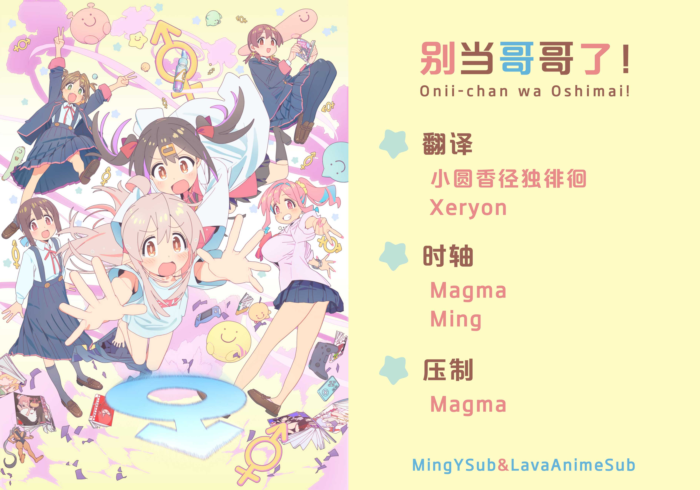

# 别当哥哥了！ / Onii-chan wa Oshimai!
| 剧集 | 中文标题 | 对应片源 | 字幕 |
| ---- | -------- | -------- | ---- |
| 01 | 真寻与不得了的身体 | Web | [简日](https://raw.githubusercontent.com/MingYSub/SubArchive/main/Archive/Onii-chan%20wa%20Oshimai!/%5BMingY%26LavaAnimeSub%5D%20Onii-chan%20wa%20Oshimai!%20%5B01%5D.CHS_JPN.ass)　[繁日](https://raw.githubusercontent.com/MingYSub/SubArchive/main/Archive/Onii-chan%20wa%20Oshimai!/%5BMingY%26LavaAnimeSub%5D%20Onii-chan%20wa%20Oshimai!%20%5B01%5D.CHT_JPN.ass)　简体　繁體　日本語 |
| 02 | 真寻与女孩子之日 | Web | [简日](https://raw.githubusercontent.com/MingYSub/SubArchive/main/Archive/Onii-chan%20wa%20Oshimai!/%5BMingY%26LavaAnimeSub%5D%20Onii-chan%20wa%20Oshimai!%20%5B02%5D.CHS_JPN.ass)　[繁日](https://raw.githubusercontent.com/MingYSub/SubArchive/main/Archive/Onii-chan%20wa%20Oshimai!/%5BMingY%26LavaAnimeSub%5D%20Onii-chan%20wa%20Oshimai!%20%5B02%5D.CHT_JPN.ass)　[简体](https://raw.githubusercontent.com/MingYSub/SubArchive/main/Archive/Onii-chan%20wa%20Oshimai!/%5BMingY%26LavaAnimeSub%5D%20Onii-chan%20wa%20Oshimai!%20%5B02%5D.CHS.ass)　[繁體](https://raw.githubusercontent.com/MingYSub/SubArchive/main/Archive/Onii-chan%20wa%20Oshimai!/%5BMingY%26LavaAnimeSub%5D%20Onii-chan%20wa%20Oshimai!%20%5B02%5D.CHT.ass)　[日本語](https://raw.githubusercontent.com/MingYSub/SubArchive/main/Archive/Onii-chan%20wa%20Oshimai!/%5BMingY%26LavaAnimeSub%5D%20Onii-chan%20wa%20Oshimai!%20%5B02%5D.JPN.ass) |
| 03 | 真寻与未知的遭遇 | Web | [简日](https://raw.githubusercontent.com/MingYSub/SubArchive/main/Archive/Onii-chan%20wa%20Oshimai!/%5BMingY%26LavaAnimeSub%5D%20Onii-chan%20wa%20Oshimai!%20%5B03%5D.CHS_JPN.ass)　繁日　简体　繁體　日本語 |
| 04 | 真寻与新朋友 | Web | [简日](https://raw.githubusercontent.com/MingYSub/SubArchive/main/Archive/Onii-chan%20wa%20Oshimai!/%5BMingY%26LavaAnimeSub%5D%20Onii-chan%20wa%20Oshimai!%20%5B04%5D.CHS_JPN.ass)　繁日　简体　繁體　日本語 |
| 05 | 真寻与辅导与邀约 | Web |  |

[PV](PV)

# Staff
**翻译：** 小圆香径独徘徊　Xeryon　last order

**时轴：** Magma　Ming

**压制：** Magma

**海报：** Ming

注：繁化由 [繁化姬](https://zhconvert.org) 完成。

# 所需字体
字体下载（将在完成全部字幕后提供网盘链接，不包含思源黑体各版本）

```
FOT-Popジョイ Std B <FOT-PopJoy Std B>
FOT-スーラ ProN B <FOT-Seurat ProN B>
冬青黑体繁体中文 W6 <Hiragino Sans TC W6>
冬青黑体简体中文 W6 <Hiragino Sans GB W6>
方正兰亭圆_GBK_粗 <FZLanTingYuan-B-GBK>
方正兰亭圆_GBK_大 <FZLanTingYuan-EB-GBK>
方正兰亭圆_GBK_中 <FZLanTingYuan-DB-GBK>
方正兰亭圆_GBK_中粗 <FZLanTingYuan-DB1-GBK>
方正少儿_GBK <FZShaoEr-M11>
方正中雅宋_GBK <FZYaSong-DB-GBK>
華康方圓體W7 <DFFangYuanW7-B5>
```