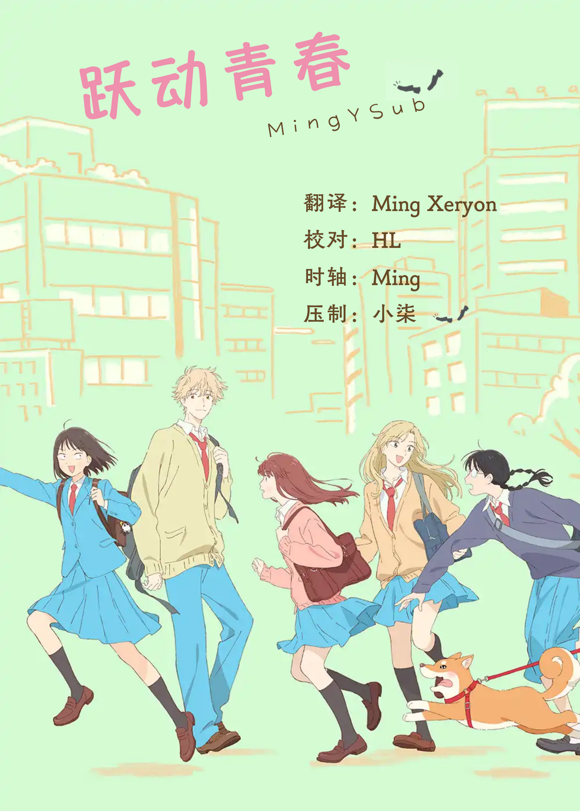

# 跃动青春 / Skip to Loafer
| 剧集 | 对应片源 | 字幕 |
| ---- | -------- | ---- |
| 01 | Web | [简日](https://raw.githubusercontent.com/MingYSub/SubsArchive/main/Archive/Skip%20to%20Loafer/%5BMingY%5D%20Skip%20to%20Loafer%20%5B01%5D.CHS_JPN.ass)　[繁日](https://raw.githubusercontent.com/MingYSub/SubsArchive/main/Archive/Skip%20to%20Loafer/%5BMingY%5D%20Skip%20to%20Loafer%20%5B01%5D.CHT_JPN.ass) |
| 02 | Web | [简日](https://raw.githubusercontent.com/MingYSub/SubsArchive/main/Archive/Skip%20to%20Loafer/%5BMingY%5D%20Skip%20to%20Loafer%20%5B02%5D.CHS_JPN.ass)　[繁日](https://raw.githubusercontent.com/MingYSub/SubsArchive/main/Archive/Skip%20to%20Loafer/%5BMingY%5D%20Skip%20to%20Loafer%20%5B02%5D.CHT_JPN.ass) |
| 03 | Web | [简日](https://raw.githubusercontent.com/MingYSub/SubsArchive/main/Archive/Skip%20to%20Loafer/%5BMingY%5D%20Skip%20to%20Loafer%20%5B03%5D.CHS_JPN.ass)　[繁日](https://raw.githubusercontent.com/MingYSub/SubsArchive/main/Archive/Skip%20to%20Loafer/%5BMingY%5D%20Skip%20to%20Loafer%20%5B03%5D.CHT_JPN.ass) |
| 04 | Web | [简日](https://raw.githubusercontent.com/MingYSub/SubsArchive/main/Archive/Skip%20to%20Loafer/%5BMingY%5D%20Skip%20to%20Loafer%20%5B04%5D.CHS_JPN.ass)　[繁日](https://raw.githubusercontent.com/MingYSub/SubsArchive/main/Archive/Skip%20to%20Loafer/%5BMingY%5D%20Skip%20to%20Loafer%20%5B04%5D.CHT_JPN.ass) |
| 05 | Web | [简日](https://raw.githubusercontent.com/MingYSub/SubsArchive/main/Archive/Skip%20to%20Loafer/%5BMingY%5D%20Skip%20to%20Loafer%20%5B05%5D.CHS_JPN.ass)　[繁日](https://raw.githubusercontent.com/MingYSub/SubsArchive/main/Archive/Skip%20to%20Loafer/%5BMingY%5D%20Skip%20to%20Loafer%20%5B05%5D.CHT_JPN.ass) |
| 06 | Web | [简日](https://raw.githubusercontent.com/MingYSub/SubsArchive/main/Archive/Skip%20to%20Loafer/%5BMingY%5D%20Skip%20to%20Loafer%20%5B06%5D.CHS_JPN.ass)　[繁日](https://raw.githubusercontent.com/MingYSub/SubsArchive/main/Archive/Skip%20to%20Loafer/%5BMingY%5D%20Skip%20to%20Loafer%20%5B06%5D.CHT_JPN.ass) |
| 07 | Web | [简日](https://raw.githubusercontent.com/MingYSub/SubsArchive/main/Archive/Skip%20to%20Loafer/%5BMingY%5D%20Skip%20to%20Loafer%20%5B07%5D.CHS_JPN.ass)　[繁日](https://raw.githubusercontent.com/MingYSub/SubsArchive/main/Archive/Skip%20to%20Loafer/%5BMingY%5D%20Skip%20to%20Loafer%20%5B07%5D.CHT_JPN.ass) |
| 08 | Web | [简日](https://raw.githubusercontent.com/MingYSub/SubsArchive/main/Archive/Skip%20to%20Loafer/%5BMingY%5D%20Skip%20to%20Loafer%20%5B08%5D.CHS_JPN.ass)　[繁日](https://raw.githubusercontent.com/MingYSub/SubsArchive/main/Archive/Skip%20to%20Loafer/%5BMingY%5D%20Skip%20to%20Loafer%20%5B08%5D.CHT_JPN.ass) |
| 09 | Web | [简日](https://raw.githubusercontent.com/MingYSub/SubsArchive/main/Archive/Skip%20to%20Loafer/%5BMingY%5D%20Skip%20to%20Loafer%20%5B09%5D.CHS_JPN.ass)　[繁日](https://raw.githubusercontent.com/MingYSub/SubsArchive/main/Archive/Skip%20to%20Loafer/%5BMingY%5D%20Skip%20to%20Loafer%20%5B09%5D.CHT_JPN.ass) |
| 10 | Web | [简日](https://raw.githubusercontent.com/MingYSub/SubsArchive/main/Archive/Skip%20to%20Loafer/%5BMingY%5D%20Skip%20to%20Loafer%20%5B10%5D.CHS_JPN.ass)　[繁日](https://raw.githubusercontent.com/MingYSub/SubsArchive/main/Archive/Skip%20to%20Loafer/%5BMingY%5D%20Skip%20to%20Loafer%20%5B10%5D.CHT_JPN.ass) |
| 11 | Web | [简日](https://raw.githubusercontent.com/MingYSub/SubsArchive/main/Archive/Skip%20to%20Loafer/%5BMingY%5D%20Skip%20to%20Loafer%20%5B11%5D.CHS_JPN.ass)　[繁日](https://raw.githubusercontent.com/MingYSub/SubsArchive/main/Archive/Skip%20to%20Loafer/%5BMingY%5D%20Skip%20to%20Loafer%20%5B11%5D.CHT_JPN.ass) |
| 12 | Web | [简日](https://raw.githubusercontent.com/MingYSub/SubsArchive/main/Archive/Skip%20to%20Loafer/%5BMingY%5D%20Skip%20to%20Loafer%20%5B12%5D.CHS_JPN.ass)　[繁日](https://raw.githubusercontent.com/MingYSub/SubsArchive/main/Archive/Skip%20to%20Loafer/%5BMingY%5D%20Skip%20to%20Loafer%20%5B12%5D.CHT_JPN.ass) |

# Staff
**翻译：** Ming　Xeryon　狐狸哟　小圆香径独徘徊　HL

**校对：** HL

**时轴：** Ming

**压制：** 小柒　kents

注：繁化由 [繁化姬](https://zhconvert.org) 完成。

# 所需字体
字体下载（将在完成全部字幕后提供网盘链接，不包含思源黑体各版本）

```
A-OTF UD新ゴ Pr6N M <A-OTF UD Shin Go Pr6N M>
FOT-つばめ Std R <FOT-Tsubame Std R>
FOT-ベビポップ Std EB <FOT-BabyPop Std EB>
たぬゴ角 太 <Tanugo-S Bold>
方正FW童趣POP体 简 <FZFW TongQu POPTiS>
方正FW珍珠体 简繁 <FZFW-ZHENZTJF-L>
方正粗楷简体 <FZCuKaiS-R-GB>
方正粗雅宋_GBK <FZYaSong-B-GBK>
方正翰宋体 简繁 Light <FZHanSongTiJF Light>
方正行楷_GBK <FZXingKai-S04>
方正华隶_GBK <FZHuaLi-M14>
方正兰亭圆_GBK <FZLanTingYuan-R-GBK>
方正兰亭圆_GBK_粗 <FZLanTingYuan-B-GBK>
方正兰亭圆_GBK_特 <FZLanTingYuan-H-GBK>
方正兰亭圆_GBK_中 <FZLanTingYuan-DB-GBK>
方正兰亭圆_GBK_中粗 <FZLanTingYuan-DB1-GBK>
方正兰亭圆_GBK_准 <FZLanTingYuan-M-GBK>
方正少儿_GBK <FZShaoEr-M11>
方正细雅宋_GBK <FZYaSong-L-GBK>
方正正粗黑_GBK <FZZhengHei-B-GBK>
方正正准黑_GBK <FZZhengHei-M-GBK>
方正中雅宋_GBK <FZYaSong-DB-GBK>
方正准雅宋_GBK <FZYaSong-M-GBK>
方正字迹-白关手绘简体 <FZZJ-BGSHJW>
更纱黑体 SC <Sarasa Gothic SC>
更纱黑体 SC Semibold <Sarasa Gothic SC Semibold>
汉仪家书繁 <HYJiaShuF>
汉仪家书简 <HYJiaShuJ>
汉仪跳跳体简 <HYTiaoTiaoTiJ>
华康手札体W5-A <DFHannotateW5-A>
華康平劇體W7 <DFPingJuW7-B5>
森泽UD新黑 Gb4 M <MO UDShinGo SC Gb4 M>
森泽UD新黑 Gb4 R <MO UDShinGo SC Gb4 R>
森澤UD新黑 標準繁體 M
霞鹜漫黑 <LXGW Marker Gothic>
```